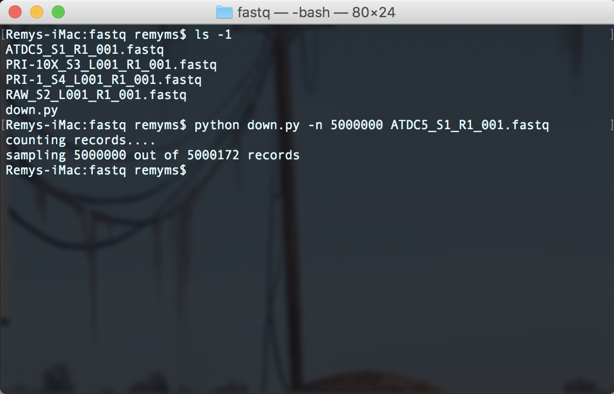

# The CellNet RNA-Seq Web Application

CellNet is a computational tool to assess the establishment of cell type specific gene regulatory networks in engineered cells. Previously we built a web application that allows researchers to upload microarray data and analyze it using CellNet. We recently adapted CellNet to analyze RNA sequencing data but processing this type of data is to computationally intensive to analyze on our own servers. Below is a walkthrough for how to use the cloud-based CellNet RNASeq web application.

The CellNet web application is provided through Amazon Web Services. This walk-though will assume that you already have an account with AWS.

## 1. Select the Cloud Formation service from the AWS services menu


## 2. Cloud Formation Homepage


##### Click "Create New Stack"

## 3. Paste the provided link to the Stack Template:


>https://s3.amazonaws.com/cahanlab/remy.schwab/CellNet_publicStack

## 4. Name your stack


## 5. Skip this page!


## 6. Review


##### Before you create the stack please skim the description. Creating the stack will launch a virtual machine costing ~$1.68 per hour.

## 7. The instance should take about five minutes to boot up


##### Amazon will let you know when everything is supposed to be ready but the link to the web application may still be unavailable for a few minutes after Amazon says it’s ready. The link will be available under the outputs tab.

## 8. Click the link! This will take you to the web application


## 8.5 Down-sampling your reads

##### In order to reduce upload times, we have capped the maximum file upload size to 2GB. We have provided a user-friendly command line tool to downsample FASTQ files. Here is some [sample data](https://s3.amazonaws.com/cahanlab/remy.schwab/app_data).

```shell
python down.py -n 5000000 reads.fastq
```



## 9. Homepage

* "Compressed read files”: In addition to being downsampled, FASTQ files should be uploaded as a GZIP compressed TAR archive! See an example command to compress read data in terminal:
    ```shell
    tar cvfz data.tgz path/to/reads
    ```

    If you are using MacOS we recommended adding the modifier:
    ```shell
    COPYFILE_DISABLE=1 tar cvfz data.tgz path/to/reads
    ```
    
* CellNet will by default map to the mouse transcriptome. Click the “Human origin” button if your data is from human cells. 
* Hit submit

## 10. Construct Sample Table


## 11. Track your Progress


##### The arrow is pointing to a slow step in the process. Do not be discouraged if the bar stays here for as long as ~5 minutes. The "Cancel Job" button will terminate any CellNet processes and return you to the homepage. ***IT DOES NOT TERMINATE THE INSTANCE***

## 12. Done


##### If you are seeing this then your job has finished.

##### Feel free to make an issue on this repository!

##### - Remy

