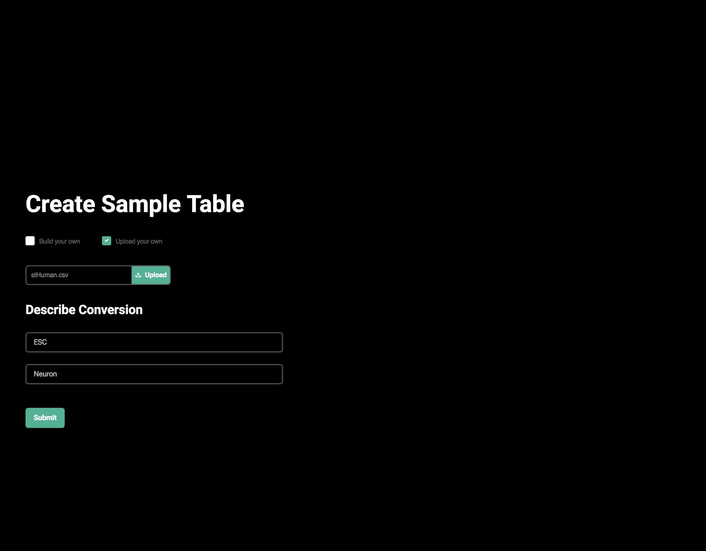

# The CellNet RNA-Seq Web Application

CellNet is a computational tool to assess the establishment of cell type specific gene regulatory networks in engineered cells. Previously we built a web application that allows researchers to upload microarray data and analyze it using CellNet. We recently adapted CellNet to analyze RNA sequencing data but processing this type of data is to computationally intensive to analyze on our own servers. Below is a walkthrough for how to use the cloud-based CellNet RNASeq web application.

The CellNet Web Application delegates compute-intensive tasks to Amazon Web Services (AWS) compute resources. To fully utilize all features of the web application, users must have the following: an AWS account, username and password, AWS Access ID and Secret Access ID, and account permissions to access to EC2, S3, and Cloud Formation.

Below is an outline of the steps needed to run the web application.

## 0. Prep your sequencing data. 

The required format for uploading FASTQ files from a local machine is a `gzip`ped `tar` archive. This means that the uncompressed FASTQ files are compressed on the command line using a command like the following:

````shell
tar -cvfz my_archive_name.tgz fastq_folder_to_compress
````

The local upload limit is capped at 4GB. 

**If the resulting archive will be larger than 4GB (or if otherwise desired), files should first be stored on AWS S3, and a path to the files can be specified in the Web Application. These files must be stored in a folder containing only the FASTQ files.** This is the recommended option.

If you have >4GB of sequencing data but prefer not to upload your files to S3, we have provided a command line script at the bottom of this README for down-sampling reads to a lower read depth, which you can use to abridge your total file size to ≤4GB.

## 1. Login to AWS and select the Cloud Formation service from the AWS services menu.


## 2. Cloud Formation Homepage


Click "Create New Stack"

## 3. Paste the provided link to the Stack Template:

Paste the following link:

>https://s3.amazonaws.com/cahanlab/remy.schwab/Stack_Templates/CellNet_publicStackTemplate.json

into the 'Specify an Amazon S3 template URL'


Clicking the link is not necessary. You only need to copy and paste it.

## 4. Name your stack as desired


## 5. Skip this page!


## 6. Review


Review the details and hit 'Create.' This will launch an EC2 instance that is running the CellNet Web Application AMI.

## 7. The instance should take about 5 minutes to initialize, but this can vary.


Amazon will let you know when everything is supposed to be ready but the link to the web application may still be unavailable for a few minutes after Amazon says it’s ready. Once the instance is ready, a URL will be available under the 'Outputs' tab. 

## 8. Click the link or navigate to this URL in another window of your browser.


This will take you to the front page of the Web Application.


## 9. Homepage

  
* Input your email address, as results will be emailed as an attachment.
* Directly upload previously compressed archive of sequencing files **OR** Specify path to FASTQ folder on S3 (See Step 0). Accessing S3 will require your S3 Access ID and Secret Access Key.
* CellNet is able to compare to both the Human and Mouse transcriptome. Please specify which species your data is coming from. 
* Submit

**It may take several minutes to an hour to proceed to the next page depending on the size of the files, as both transfer and decompression is finished before the next step.**

## 10. Construct or upload sample metadata table.




If uploading, see the [CellNet GitHub page](https://github.com/pcahan1/CellNet) or [Radley et al, 2016](https://www.nature.com/articles/nprot.2017.022) for required metadata table format. 

Also specify starting and target cell types.

When finished, click Submit.

## 11. Track your Progress


The arrow is pointing to a slow step in the process. Do not be discouraged if the bar stays here for as long as 30 minutes. 

You can use the "Cancel Job" button to terminate the entire process and return you to the homepage. However, ***IT WILL NOT TERMINATE THE INSTANCE***

## 12. Done


This screen indicates analysis has finished. CellNet analysis is complete!

## 13. **IMPORTANT:** Once finished, make sure to delete the Stack.


Confirm "Yes, Delete"

This will terminate the running EC2 instance. AWS will continue to charge the user for computational resources used until the Stack is deleted.


---


## Down-sampling your reads

We have provided a command line tool to downsample FASTQ files. 

Download `down.py`.

Here is some [sample data](https://s3.amazonaws.com/cahanlab/remy.schwab/app_data).


This picture shows what your setup should look like. Put all of the FASTQ files you plan on uploading in one directory. For simplicity we recommend you put the `down.py` executable in the same directory as the directory containing your FASTQ files. Below is an example command you would use to sample 5 million reads from each FASTQ file.

```shell
./down -n 5000000 FASTQ
```


You should see this output after entering in the above command. A temporary directory containing the downsampled files will appear.


This is what you should see if the downsampling process has finished successfully. The final output is a GZipped compressed, TAR archive. This can be directly uploaded to CellNet.

